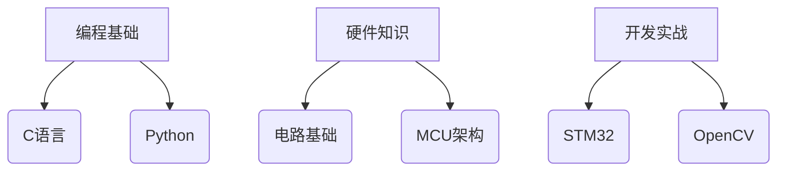

# 🎓 嵌入式智控协会

  新功能 v2.1
  移动端优化

## 🚀 快速开始

  

    <i class="icon">📚</i>
    <h3>打开目录</h3>
    
点击右下角悬浮按钮浏览课程体系

  

  
  

    <i class="icon">🔍</i>
    <h3>智能搜索</h3>
    
输入关键词快速定位内容

  

## 🌟 核心功能

## 🛠 技术架构
| 模块       | 技术栈                | 版本     |
|------------|----------------------|----------|
| 前端框架   | HTML5/CSS3/ES6       | 2023标准 |
| 解析引擎   | Marked.js + Prism    | v5.0.2   |
| 可视化     | Mermaid              | v9.1.3   |
| 交互系统   | 原生JavaScript       | ES2022   |

  

    <i class="material-icons">touch_app</i>
    手势操作支持
  

  

    <i class="material-icons">animation</i>
    60fps流畅动画
  

> 📍 使用贴士：长按目录项可添加书签，双击章节快速定位 