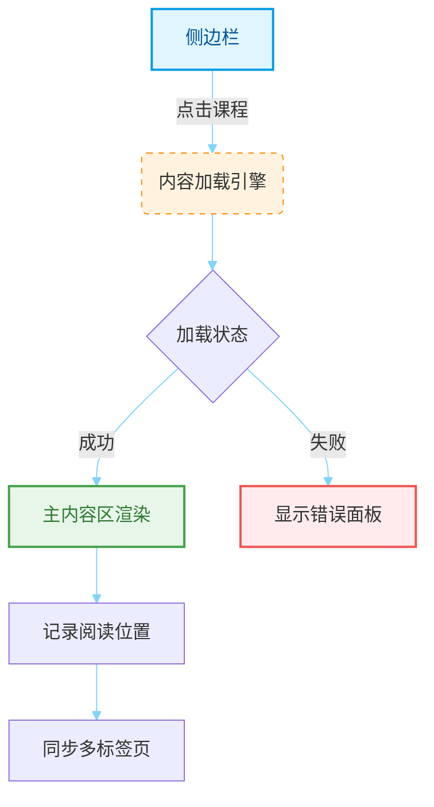

# 🎓 协会培训中心使用手册

---

## 📱 移动端操作指南
### 🌟 核心交互流程
<details open>
<summary>📖 课程目录操作</summary>

1. **目录唤醒**  
   🟣 点击右下角悬浮的「📚」图标按钮  
   🌈 目录将以模态层形式从底部升起（透明度渐变效果）

2. **精准搜索**  
   🔍 顶部集成智能搜索框支持：  
   - 实时联想（300ms 防抖处理）
   - 多关键词「空格分隔」搜索
   - 动态高亮匹配结果

3. **内容呈现**  
   ```mermaid{theme: merMAID, fontSize: 14, fontFamily: 'Arial'}
   %% {init: {'themeVariables': { 
       'primaryColor': '#e3f2fd',
       'edgeLabelBackground':'#fff8e1',
       'clusterBkg': '#f5f5f5',
       'clusterBorder': '#90a4ae'
   }}} %%
   graph LR
       A[点击课程] -->|异步请求| B{内容加载}
       B -->|成功| C[渐显动画]
       B -->|失败| D[红色警示条]
       
       style A fill:#1e88e5,stroke:#0d47a1,color:#fff,stroke-width:2px
       style B fill:#ffd54f,stroke:#f57f17,stroke-width:2px
       style C fill:#66bb6a,stroke:#2e7d32,stroke-width:2px
       style D fill:#ef5350,stroke:#c62828,stroke-width:2px
       
       classDef arrow fill:#b3e5fc,stroke:#01579b;
       linkStyle 0,1,2 stroke:#01579b,stroke-width:2px,fill:none;
   ```
</details>

---

## 💻 桌面端操作指南
### 🖥️ 双屏交互体系



### 1. 导航侧边栏
- 左侧常驻300px宽侧边栏
- 滚动时自动粘性定位
- 支持快捷键操作：
  - `Ctrl+F` 聚焦搜索框
  - `↑/↓` 目录导航

### 2. 内容区域
- 右侧主内容区自适应宽度
- 支持以下交互：
  - 代码块悬停显示复制按钮
  - 表格响应式滚动
  - 流程图点击放大

### 3. 课程切换
- 点击侧边栏课程项即时加载
- 自动记录最后阅读位置
  - 关闭浏览器后仍保留进度
  - 支持多标签页同步

## 🌐 通用功能

### 1. 内容高亮
- 搜索关键词自动标记黄色背景
- 支持多关键词匹配（空格分隔）

### 2. 进度指示
- 顶部3px红色进度条实时显示阅读位置
- 滚动时自动更新进度

### 3. 异常处理
| 状态     | 表现                    | 解决方案         |
| -------- | ----------------------- | ---------------- |
| 加载失败 | 显示红色警告框+重试按钮 | 点击按钮重新加载 |
| 内容过期 | 显示缓存标识⚠️           | 手动刷新页面     |
| 空搜索   | 显示「无结果」提示      | 修改搜索关键词   |

### 4. 辅助功能
- 深色模式自适应（跟随系统）
- 字体大小响应式调整
- 触控板/鼠标滚轮优化