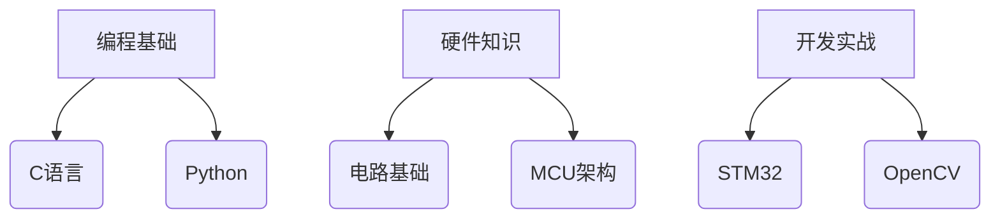
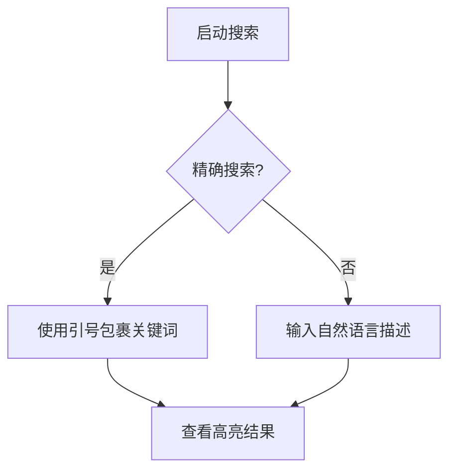

# 🎓 嵌入式智控协会

  新功能 v2.1
  移动端优化

## 🚀 快速开始

  

    <i class="icon">📚</i>
    <h3>打开目录</h3>
    
点击右下角悬浮按钮浏览课程体系

  

  
  

    <i class="icon">🔍</i>
    <h3>智能搜索</h3>
    
输入关键词快速定位内容

  

## 🌟 核心功能

## 🛠 技术架构
| 模块       | 技术栈                | 版本     |
|------------|----------------------|----------|
| 前端框架   | HTML5/CSS3/ES6       | 2023标准 |
| 解析引擎   | Marked.js + Prism    | v5.0.2   |
| 可视化     | Mermaid              | v9.1.3   |
| 交互系统   | 原生JavaScript       | ES2022   |

  

    <i class="material-icons">touch_app</i>
    手势操作支持
  

  

    <i class="material-icons">animation</i>
    60fps流畅动画
  

## 📖 操作指南（全平台通用）

### 🧭 基本导航

  

    <i class="icon">📂</i>
    <h4>目录访问</h4>
    <ul>
      <li>PC端：侧边栏常驻</li>
      <li>移动端：右下角悬浮按钮</li>
    </ul>
  

### ✨ 核心交互

  

    <i class="icon">👆</i>
    

      <strong>内容选择</strong>
      
单击条目查看详情 双击章节标题快速定位

    

  

  
  

    <i class="icon">🖱️</i>
    

      <strong>快捷操作</strong>
      
长按目录项 2秒 添加书签 右键/长按图表可导出图片

    

  

### 📱 设备适配
| 操作类型 | 移动端交互       | PC端交互        |
|----------|------------------|-----------------|
| 缩放     | 双指捏合         | Ctrl+鼠标滚轮   |
| 滚动     | 单指滑动         | 鼠标滚轮        |
| 返回     | 底部导航按钮     | 浏览器返回按钮  |

### 🔍 搜索技巧

> ✅ 注意事项： 
> 1. 首次使用建议完成5分钟引导教程 
> 2. 手势操作需保持触控区域清洁 
> 3. 复杂图表操作建议横屏使用

> 📍 使用贴士：长按目录项可添加书签，双击章节快速定位 